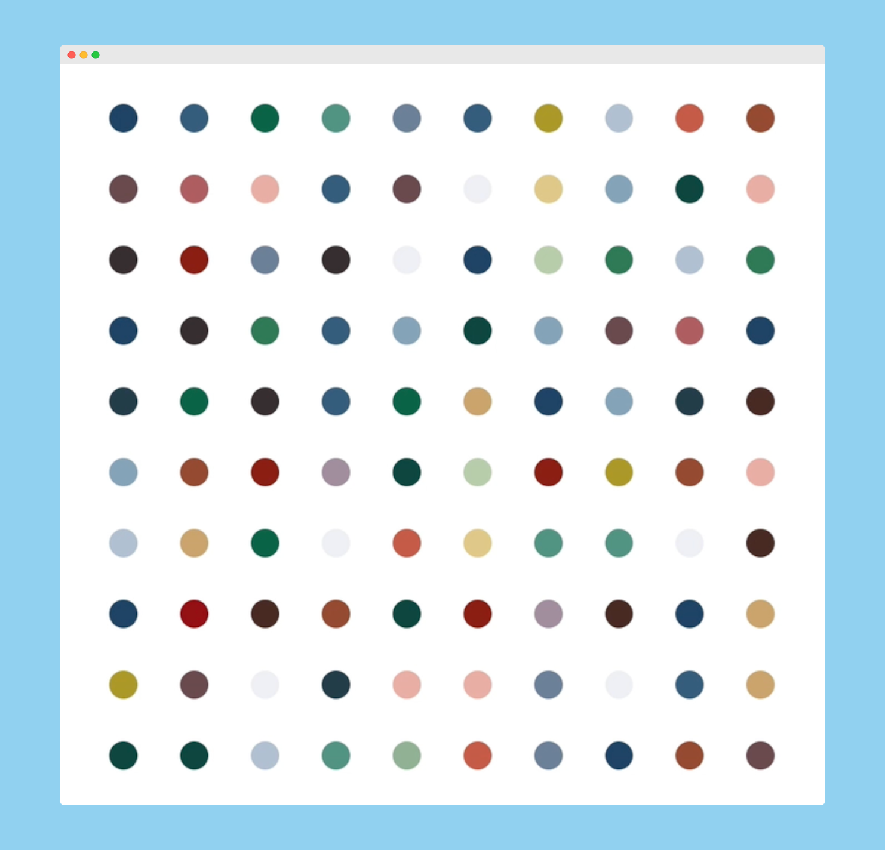

# Million Dollar Painting

## Description
A Damien Hirst's style dot painting made with python's inbuilt module Turtle.

## Screenshot


## How to Use
1. **Clone the Repository:**
    ```bash
    git clone https://github.com/akdevv/mini-python-projects.git
    cd mini-python-projects
    cd million-dollar-painting
    ```
2. **Run _main.py_:**
    ```bash
    python main.py
    ```