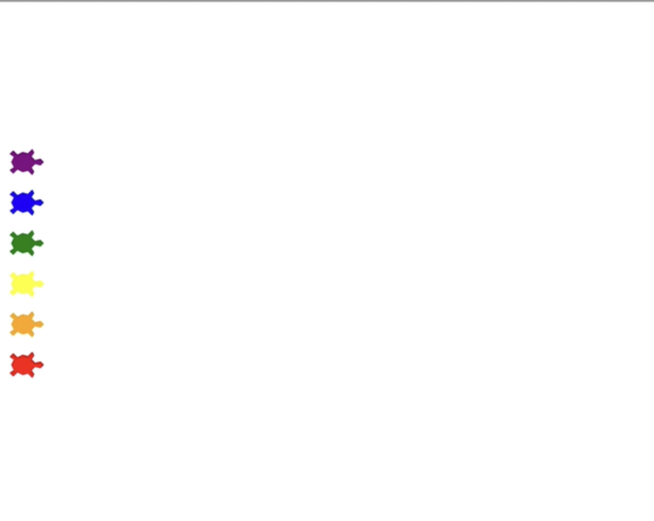

# Turtle Racing Game

## Description
Turtle Raing Game is made using Python's turtle graphics module. Here, the users places bet on a turtle from six different turtles. The turtle moves randomly and one turtle wins in the end.

## How to Use
1. **Clone the Repository:**
    ```bash
    git clone https://github.com/akdevv/mini-python-projects.git
    cd mini-python-projects
    cd turtle-racing-game
    ```

2. **Run _main.py_:**
    ```bash
    python main.py
    ```

## Examples
